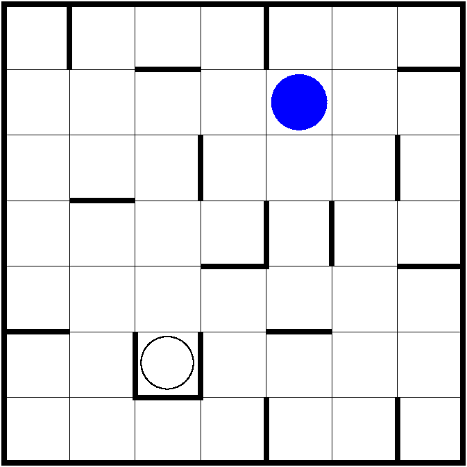

# Thesus Finds the Exit

Consider the labyrinth below:

The goal of the game is to navigate the blue ball to the square marked with the empty circle.

## Rules

- In a move, the ball must be rolled to up, right, down, or left.
- The ball moves until it reaches the wall around the labyrinth or any inner wall.

## Technical Implementation

- Uses MVC pattern.
- The game loads the labyrinth from a `JSON` file, which makes it easily extensible to add more maps.
- Write results to a `JSON` file using [jackson](https://github.com/FasterXML/jackson).

This project was made under the supervision of [Dr Péter Jeszenszky](https://inf.unideb.hu/dr-jeszenszky-peter), professor at the University of Debrecen.

